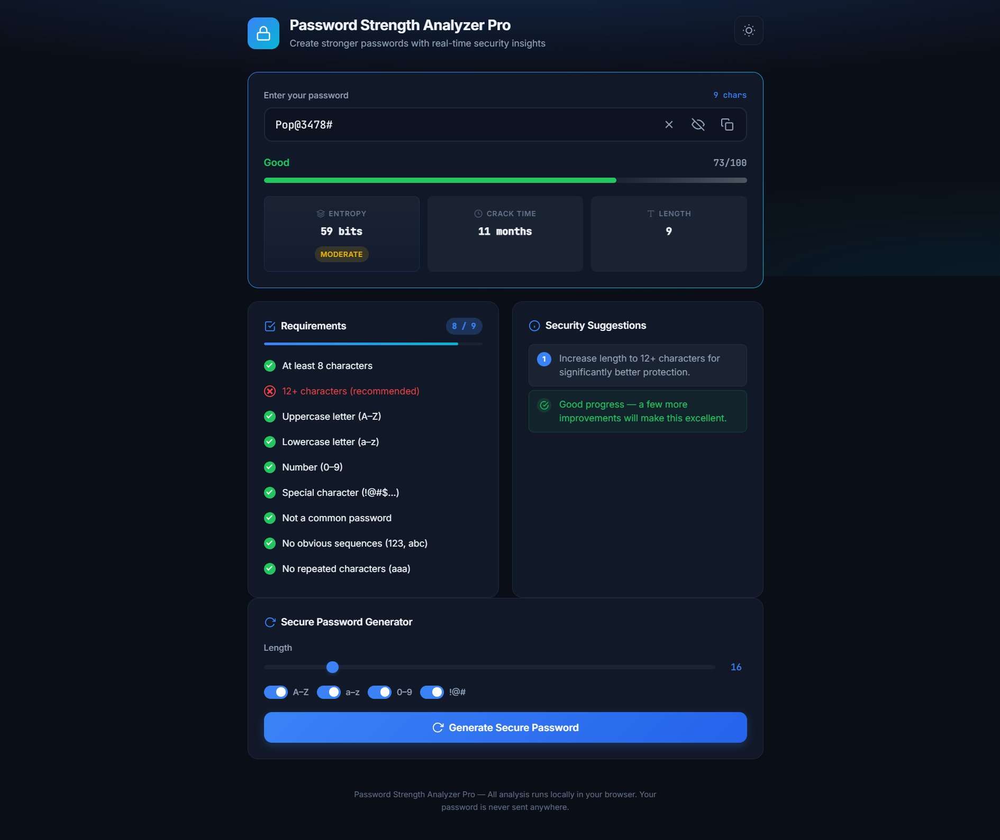
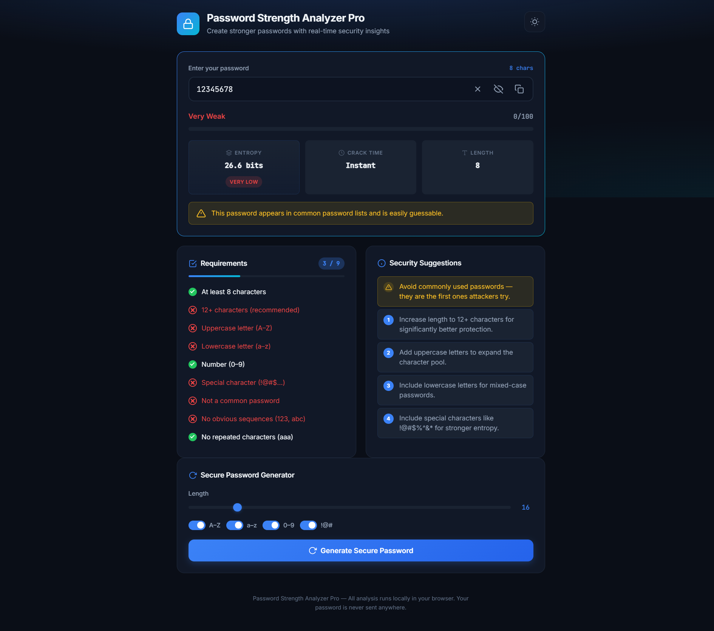
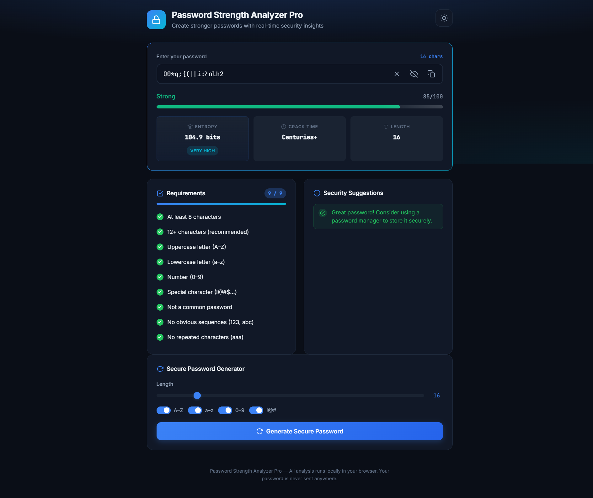
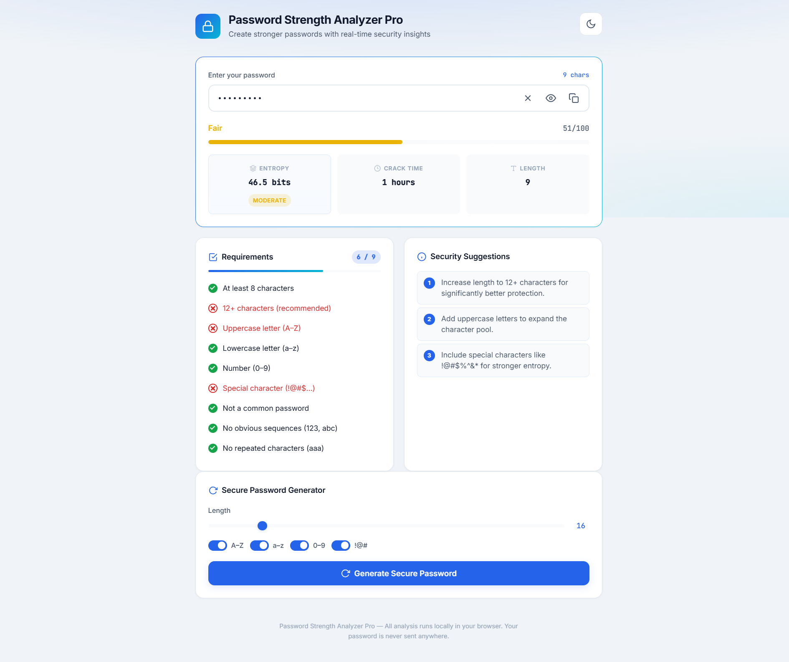

# Password Strength Analyzer Pro

A modern, responsive web application that helps users create secure passwords through real-time analysis and visual feedback. All processing runs locally in your browser — your password is never transmitted anywhere.


---

## 📸 Screenshots

### 🔐 Good Password Analysis (Dark Mode)



---

### ⚠️ Weak Password Detection



---

### 🎲 Generate Secure Password



---

### 🌙 Light Theme



---

## Features

- **Real-time password strength analysis** — Instant feedback as you type
- **Animated strength meter** — Visual bar with smooth transitions
- **Password score** — Numerical rating from 0–100
- **Show/Hide password** — Toggle visibility with one click
- **Live requirement checklist** — Track length, character types, and common pitfalls
- **Secure password generator** — Cryptographically random passwords with customizable options
- **Copy password** — One-click clipboard copy
- **Password entropy estimation** — Shannon entropy in bits
- **Estimated crack time** — Time-to-crack based on entropy and attack rate
- **Common password detection** — Flags passwords from known breach lists
- **Dynamic security suggestions** — Context-aware tips to improve your password
- **Dark/Light mode** — Theme toggle with system preference detection
- **Responsive UI** — Works on desktop, tablet, and mobile

## Tech Stack

- HTML5
- CSS3 (custom properties, flexbox, grid)
- Vanilla JavaScript (no dependencies)

## Getting Started

No build step or installation required.

1. Clone or download this repository
2. Open `index.html` in any modern web browser

Alternatively, serve locally with any static file server:

```bash
# Python
python -m http.server 8080

# Node.js (npx)
npx serve .
```

Then visit `http://localhost:8080`.

## Usage

1. **Analyze** — Type a password in the input field to see real-time strength analysis, entropy, and crack time estimates.
2. **Generate** — Use the password generator to create a cryptographically secure password. Adjust length (8–64) and character types as needed.
3. **Copy** — Click the copy button to copy the password to your clipboard.
4. **Theme** — Toggle between dark and light mode using the button in the header.

### Keyboard Shortcut

- `Ctrl/Cmd + G` — Generate a new secure password

## How Scoring Works

The password score (0–100) considers:

| Factor | Impact |
|--------|--------|
| Length | Up to 30 points |
| Character variety (lower, upper, numbers, symbols) | Up to 30 points |
| Entropy | Up to 25 points |
| Common password | −40 points |
| Obvious sequences (123, abc) | −15 points |
| Repeated characters (aaa) | −10 points |

Crack time is estimated using entropy and an assumed offline attack rate of 10 billion guesses per second.

## Privacy

All analysis is performed entirely in your browser. No passwords are sent to any server, stored, or logged.

## Browser Support

Works in all modern browsers that support:

- CSS custom properties
- `crypto.getRandomValues()`
- Clipboard API (with fallback)

## License

Open source — feel free to use and modify for our projects.

## Contributing

Contributions are welcome! Feel free to open issues or submit pull requests.
